# 5분만에 Apache Kafka Cluster 만들어보기 
(with [Bitnami Helm Chart](https://github.com/bitnami/charts))

## 준비물
- Docker
- Kubernetes 
  - 여기서는 [Rancher](https://rancher.com/)를 이용하였다
  - [Minikube](https://minikube.sigs.k8s.io/docs/start/)를 이용한다면 아래의 실습의 `localhost` 부분들을 `minikube ip`로 대체해야 한다(`$minikube ip`로 조회)
- Helm
- Kafka Client

## Getting Started
### 1. 본 Git Repository를 Clone한다
```bash
$ git clone git@github.com:LOG-INFO/kafka-clsuter-with-bitnami.git
```

### 2. Bitnami Helm Repository를 추가한다 ([Helm 설치](https://helm.sh/docs/intro/install/))
```bash
$ helm repo add bitnami https://charts.bitnami.com/bitnami
```

### 3. Bitnami kafka Helm Chart를 실행한다
```bash
# 기본 values.yaml이 있긴 하지만, 덮어쓰고 싶은 내용들은 kafka/values.yaml을 참조한다
# 설정값을 변경하고 싶다면 https://github.com/bitnami/charts/tree/master/bitnami/kafka/#installing-the-chart 를 참고한다
$ helm install kafka -f kafka/values.yaml bitnami/kafka
```

### 4. Kubernetes Pods, Services가 잘 생성되었는지 확인한다
```bash
$ kubectl get pods                                                                                                                                               INT  rancher-desktop kube
NAME                             READY   STATUS    RESTARTS      AGE
kafka-0                          2/2     Running   6             1m
kafka-1                          2/2     Running   6             1m
kafka-2                          2/2     Running   6             1m
kafka-zookeeper-0                1/1     Running   1             1m
kafka-zookeeper-1                1/1     Running   1             1m
kafka-zookeeper-2                1/1     Running   1             1m
kafka-exporter-97b464596-c46zm   1/1     Running   6             1m

$ kubectl get services                                                                                                                                                  ok  rancher-desktop kube
NAME                       TYPE        CLUSTER-IP      EXTERNAL-IP   PORT(S)                      AGE
kafka                      ClusterIP   10.43.175.234   <none>        9092/TCP                     1m
kafka-headless             ClusterIP   None            <none>        9092/TCP,9093/TCP            1m
kafka-0-external           NodePort    10.43.5.144     <none>        9094:30001/TCP               1m
kafka-1-external           NodePort    10.43.83.102    <none>        9094:30002/TCP               1m
kafka-2-external           NodePort    10.43.73.183    <none>        9094:30003/TCP               1m
kafka-zookeeper            ClusterIP   10.43.201.237   <none>        2181/TCP,2888/TCP,3888/TCP   1m
kafka-zookeeper-headless   ClusterIP   None            <none>        2181/TCP,2888/TCP,3888/TCP   1m
kafka-metrics              ClusterIP   10.43.242.108   <none>        9308/TCP                     1m
kafka-jmx-metrics          ClusterIP   10.43.201.19    <none>        5556/TCP                     1m
```

### 5. Kafka가 잘 동작하는지 확인한다

> 동작수행 확인을 위한 임시 컨테이너를 띄운다.

1. 임시 컨테이너에서 콘솔 프로듀서를 띄워서 카프카 메시지 전송을 테스트

```sh
$ docker run --network host --rm -it -u 0 bitnami/kafka /bin/bash
root@docker-desktop:/# /opt/bitnami/kafka/bin/kafka-console-producer.sh --bootstrap-server localhost:30001,localhost:30002,localhost:30003 --topic test
>{"message":"test_message"}
>^C # Ctrl + C
```

2. 테스트 메시지 컨슈밍 테스트

```
root@docker-desktop:/# /opt/bitnami/kafka/bin/kafka-console-consumer.sh --bootstrap-server localhost:30001,localhost:30002,localhost:30003 --topic test --from-beginning --group test
{"message":"test_message"} # 메시지 입수 확인
```

### 6. 모니터링 지표 수집을 위한 Prometheus, Grafana의 Deployment, Service를 생성한다
```bash
$ kubectl apply -f prometheus,grafana
```

### 7. Prometheus, Grafana의 Pods, Services가 잘 생성되었는지 확인한다
```bash
kubectl get pods                                                                                                                                               INT  rancher-desktop kube
NAME                             READY   STATUS    RESTARTS      AGE
prometheus-776fd895bc-vg87g      1/1     Running   1             1m
grafana-9bd5bbd6b-x5khn          1/1     Running   1             1m

$ kubectl get services                                                                                                                                                 
NAME                       TYPE        CLUSTER-IP      EXTERNAL-IP   PORT(S)                      AGE
grafana                    NodePort    10.43.194.39    <none>        3000:31000/TCP               1m
prometheus                 NodePort    10.43.224.108   <none>        9090:31001/TCP               1m
```

### 8. Prometheus, Grafana에 접속한다
- Prometheus: http://localhost:31001/
  - Query 확인
    - 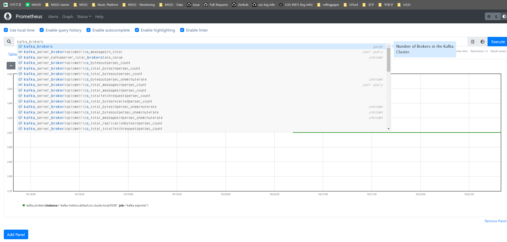
  - Targets 확인
    - 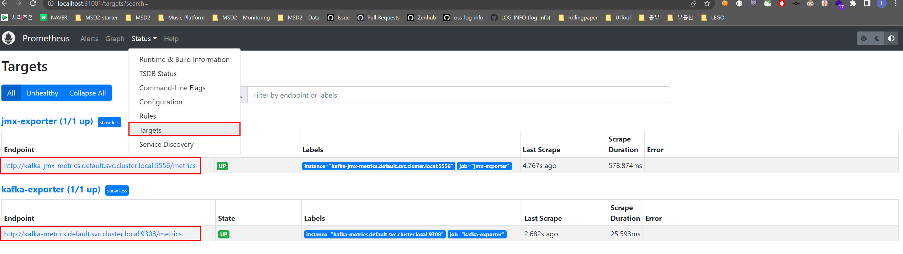
- Grafana: http://localhost:31000/
  - Grafana의 초기 계정은 `admin`/`admin`이다
  - 처음엔 Grafana에 아무 대시보드도 존재하지 않는다
  - 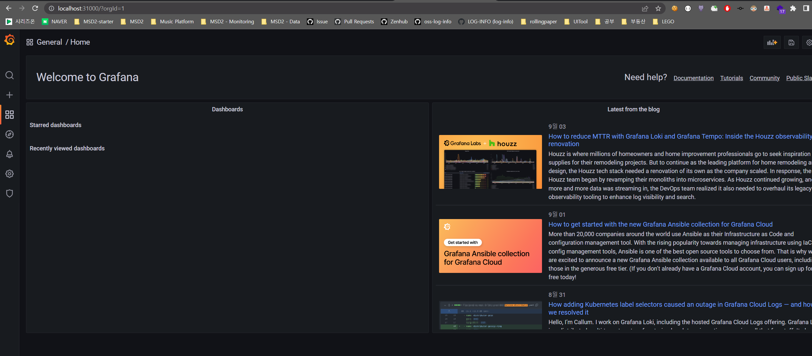

### 9. Grafana에 DataSource 추가
#### 1. DataSource 추가 버튼 클릭 -> `Prometheus` 선택
- 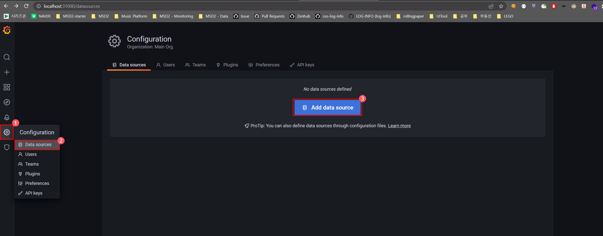
#### 2. URL에 Prometheus의 [Kubernetes Service DNS]([url](https://kubernetes.io/docs/concepts/services-networking/dns-pod-service/)) 입력 - `http://prometheus.default.svc.cluster.local:9090`
- 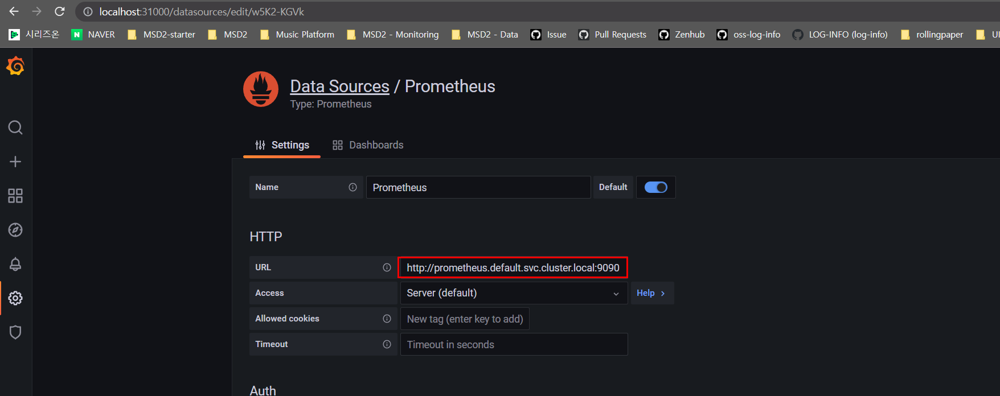
#### 3. 하단의 `Save $ Test` 클릭
- 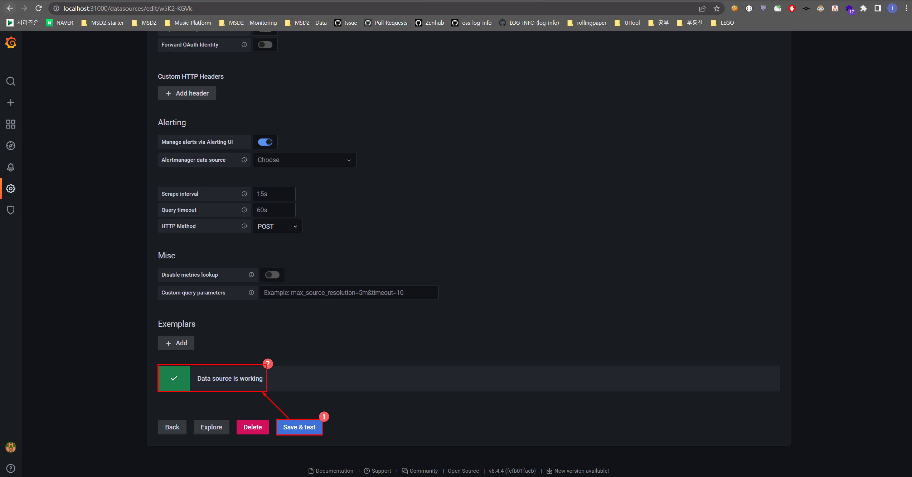

### 10. Garafana에 Dashboard 추가
- Kafka JMX Grafana Dashboard (Grafana Dashboard ID: `12483`)
  - https://grafana.com/grafana/dashboards/12483-kubernetes-kafka/
- Kafka Grafana Dashboard (Grafana Dashboard ID: `7589`)
  - https://grafana.com/grafana/dashboards/7589-kafka-exporter-overview/

#### 1. Dashboard Import 클릭
- 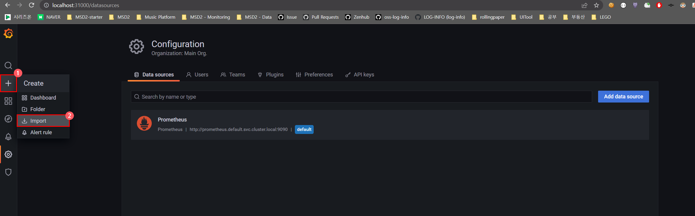

#### 2. `Import via grafana.com`에 `12483` 입력 후 `Load` 버튼 클릭
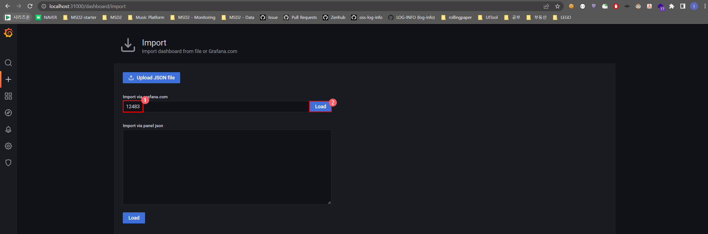

#### 3. Data Source 선택 후 `Import` 버튼 클릭
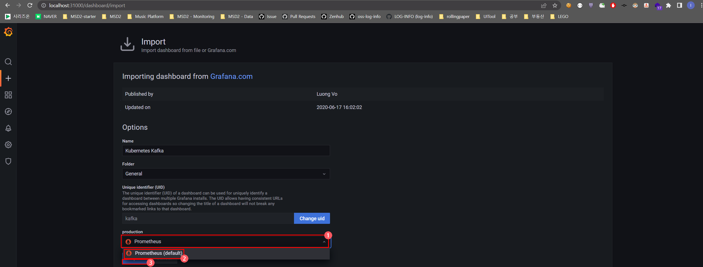

#### 4. Dashboard 추가된 것 확인
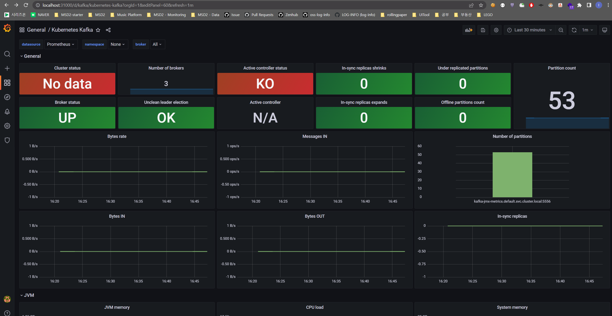

#### 5. 다시 Dashboard Import로 가서 `Import via grafana.com`에 `7589` 입력 후 `Load` 버튼 클릭


#### 6. Data Source 선택 후 `Import` 버튼 클릭
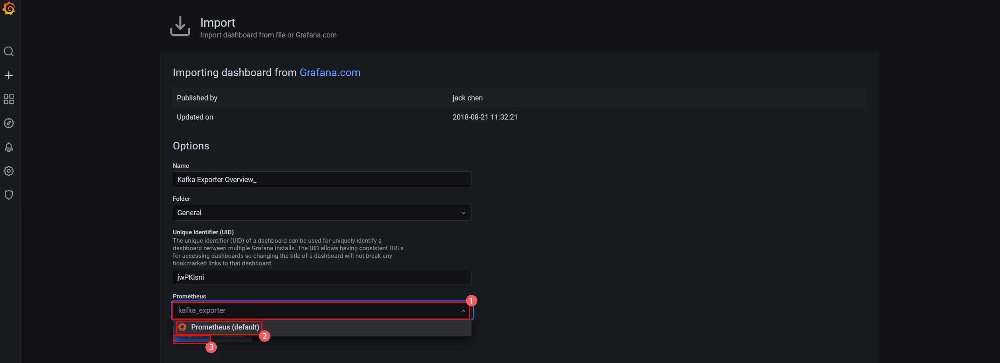

#### 7. Dashboard 추가된 것 확인
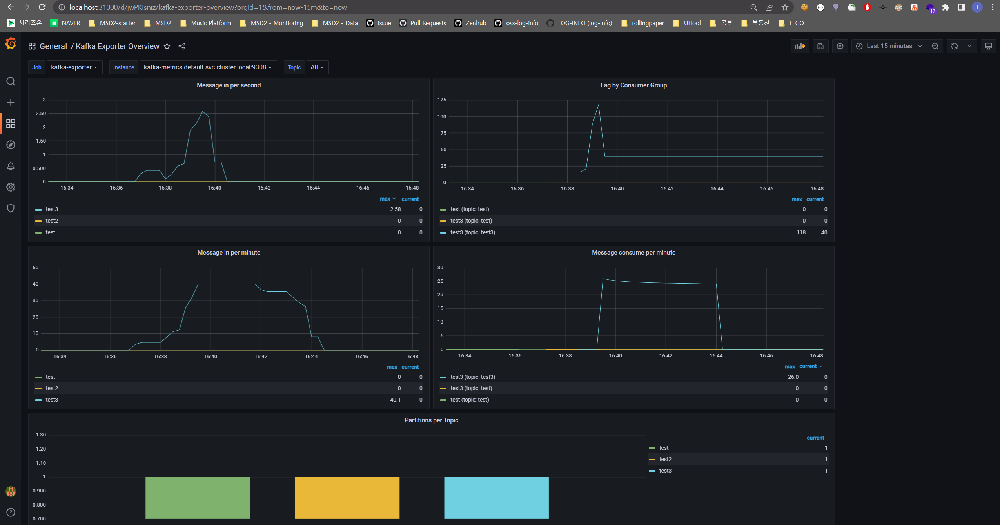

### 11. 카프카 클러스터를 종료한다
```bash
$ helm delete kafka
```

### 12. Prometheus, Grafana도 종료한다
```bash
$ kubectl delete -f prometheus,grafana
```

## 참고
- https://bitnami.com/stack/kafka/helm
